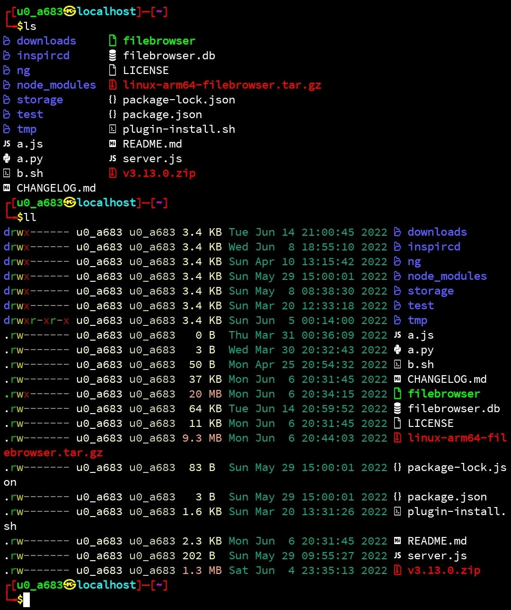
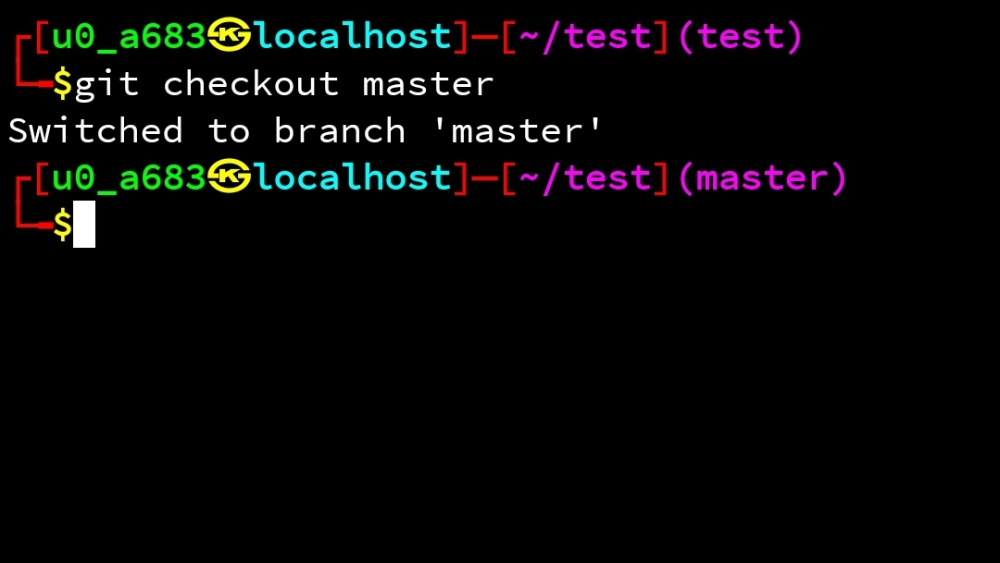
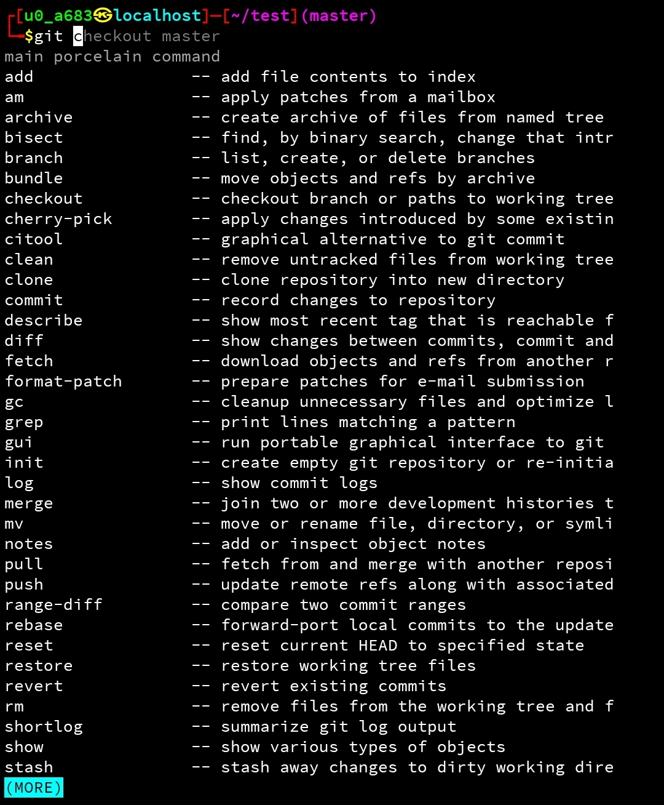
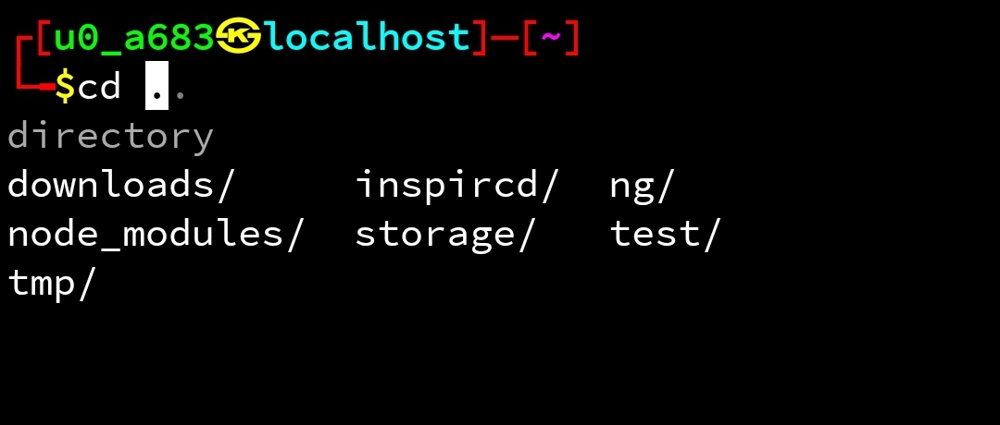

# Termux-dotfiles

Best zsh vanilla theme for yuor termux.

## Features

* Dynamic git branch name
* Colourful outputs
* file icons
* command auto-suggestion
* command auto-complete

## install

```sh
curl 'https://raw.githubusercontent.com/jakbin/myzsh/main/termux/install.sh' | sh
```

## install plugins

```sh
wget 'https://raw.githubusercontent.com/jakbin/myzsh/main/termux/plugin-install.sh' && bash plugin-install.sh
```

## Screenshots


Directory Listing




Git branch name




Auto Suggestions




Auto Complete


